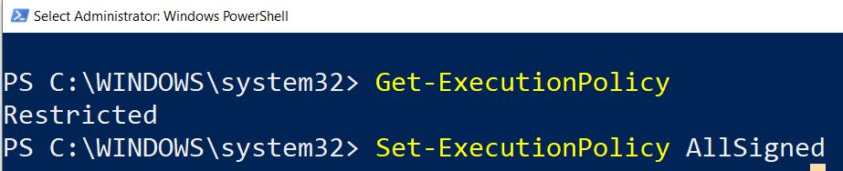
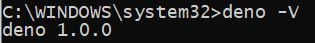
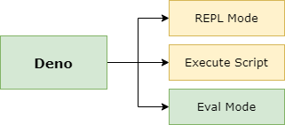

# Mastering-DenoTheWKWKLand
## Lets Destroy Node.js developer.


## Installation

### Install Deno For Windows

Kita akan melakukan instalasi ***Deno*** menggunakan ***Package Manager*** yang disebut dengan ***Chocolatey*** :

#### 1. *Install Chocolatey Package Manager*

Jalankan **Powershell** (**run as administrator**), kemudian eksekusi perintah di bawah ini :



Setelah itu eksekusi perintah ***powershell*** di bawah ini :

```powershell
Set-ExecutionPolicy Bypass -Scope Process -Force; [System.Net.ServicePointManager]::SecurityProtocol = [System.Net.ServicePointManager]::SecurityProtocol -bor 3072; iex ((New-Object System.Net.WebClient).DownloadString('https://chocolatey.org/install.ps1'))
```

Proses instalasi sedang di lakukan, kita akan memiliki ***directory* Chocolatey Package Repository** di :

```
C:\ProgramData\chocolatey\lib
```

Kita juga akan memiki ***directory*** untuk ***Chocolatey Binary*** di :

```
C:\ProgramData\chocolatey\bin
```

Pastikan ***chocholatey*** sudah terpasang dengan cara mengeksekusi perintah di bawah ini dalam **cmd.exe** :

```
choco
```

Maka informasi versi ***choco*** akan di tampilkan :

```
Chocolatey v0.10.15
```

#### 2. *Install Deno Via Package Manager*

Lakukan instalasi ***Deno*** menggunakan perintah di bawah ini :

```
choco install deno
```

Jika berhasil maka dalam d***irectory Chocolatey Package Repository***, ***package Deno*** akan tersimpan :

```
C:\ProgramData\chocolatey\lib\deno
```

#### 3. Check Deno

Check Eksistensi ***Deno*** dengan mengeksekusi perintah di bawah ini :

```
deno -V
```

Jika berhasil maka akan muncul informasi versi deno yang sedang kita gunakan :



### Install Deno For Linux


### Install Deno For MacOS


## Deno 101

Untuk memulai menggunakan **Deno** ada 3 langkah yang bisa kita gunakan :



### REPL Mode Execution

Untuk menggunakan Deno dalam Mode ***REPL*** Mode, pada ***cmd.exe*** ketik :

```
deno
```

Eksekusi ***statement*** di bawah ini :

```javascript
1+1
```

Kemudian eksekusi ***statement*** di bawah ini untuk menampilkan pesan Hello World

```javascript
console.log("Hello World")
```

Jika berhasil maka akan memproduksi :

```
Hello World
```

Jika ingin keluar dari ***REPL Mode***, klik ***CTRL+Shift+D***.

### Execution Script

Jika kita ingin mengeksekusi sebuah ***file javascript*** yang telah diubah menjadi ***typescript*** menggunakan ***deno***, eksekusi perintah di bawah ini :

```
deno run https://deno.land/std/examples/welcome.ts
```

Maka anda akan melihat output informasi seperti di bawah ini :

```
Download https://deno.land/std/examples/welcome.ts
Warning Implicitly using master branch https://deno.land/std/examples/welcome.ts
Compile https://deno.land/std/examples/welcome.ts
Welcome to Deno 🦕
```

