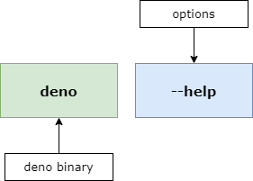
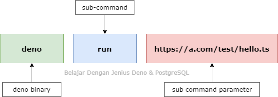
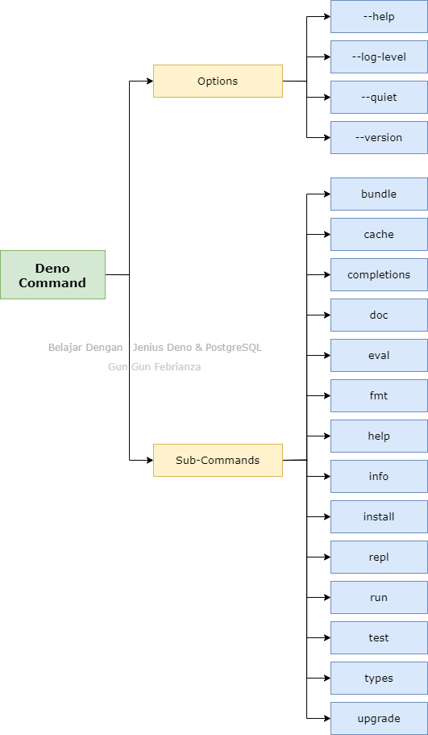

# Belajar Dengan Jenius Deno


## Table of Contents
- Open Library Indonesia
- Metode Belajar
    - Learning Problems & Abstraction Control
- Matthew Effect in Reading
- Persiapan
    - Apa saja yang harus dipersiapkan?
        - Install Node.js
        - Install Visual Studio Code
        - Install Python
        - Install Google Chrome atau Firefox
        - Install Git
        - Install Postman
    - Konvensi Penulisan?
    - Feedback?
    - Kode Sumber?
    - Penggunaan Kode?
    - Terdapat Kesalahan?
    - https://github.com/gungunfebrianza/Belajar-Dengan-Jenius-DenoTheWKWKLand
    - Pertanyaan, Kritik dan Saran?
- Chapter 1
    - Belajar Open Web Platform
    - Subchapter 1 - Apa itu Open Web Platform
        - 1\. Technical Specification
        - 2\. HTML 5.2
            - Semantic Advantage
            - Connectivity Advantage
            - Storage Advantage
            - Multimedia Advantage
            - Performance Advantage
            - Device Access Advantage
            - Specification
        - 3\. Web Assembly
            - Safe
            - Fast
            - Portable Code
            - Compact Code
            - Specification
        - 4\. EcmaScript
            - Specification
        - 5\. Web Socket
            - Specification
            - Application
        - 6\. WebRTC
            - Specification
            - Application
        - 7\. WebGL
            - Specification
            - Application
    - Subchapter 2 - Apa itu Web Application?
        - 1\. Server
            - File Server
            - Mail Server
            - Proxy Server
            - Application Server
            - Database Server
            - Messaging Server
        - 2\. Virtual Private Server
            - Virtualization
            - Virtual Machine
            - Hypervisor
        - 3\. Web Server
        - 4\. Web Page
            - Static Web Page
            - Dynamic Web Page
            - Progressive Web Application (PWA)
            - Single Page Application (SPA)
        - 5\. Network
            - Local Area Network (LAN)
            - World Area Network (WAN)
            - Internet Service Provide (ISP)
        - 6\. Internet
            - Internet Transit
            - Satellite & Fiber Optic
        - 7\. Internet Exchange Point
        - 8\. Content Delivery Network (CDN)
        - 9\. Cloud Computing
            - Cloud Computing Execution Model
            - Cloud Service Provider
            - Scalability
            - Load Balancer
        - 10\. Serverless Computing
            - FaaS Provider
            - AWS Lambda
    - Subchapter 3 - Bedah Konsep HTTP
        - 1\. HTTP & URL
            - HTTP
            - Hypertext & Hyperlink
            - Hypermedia
            - World Wide Web (www)
            - Uniform Resources Identifier (URI)
            - URL / Web Resources
        - 2\. HTTP & DNS
            - IP Address
            - DNS Resolver
            - Root Server & TLD Server
        - 3\. HTTP Transaction
            - TCP Three-way Handshake
        - 4\. HTTP Request
            - HTTP Method
            - Message
            - HTTP Header
            - Header Attribute
            - MIME
        - 5\. HTTP Response
        - 6\. HTTP Status Message
    - Subchapter 4 - Web Security
        - 1\. Data in The Low Level
            - Host
            - Socket
            - Bit
            - Byte
            - Bytes
            - Character
            - ASCII
            - Data Transmission
            - Base64 Encoding
        - 2\. Cryptography
            - Cryptoanalys
            - Information Security
            - Ciphertext
            - Symmetric Cryptography
            - Hash Function
            - Message Authentication Codes (MAC)
            - Assymetric Cryptography
            - Cryptography Protocol
        - 3\. Man In The Middle (MITM) Attack
            - Eavesdropping
        - 4\. HTTPS
            - Perbedaan HTTP & HTTPS
            - Manfaat HTTPS
        - 5\. Secure Socket Layer (SSL)
            - Transport Socket Layer (TLS)
            - SSL Handshake
- Chapter 2
    - Setup Learning Environment
    - Subchapter 1 - Visual Studio Code
        - 1\. Install Programming Language Support
        - 2\. Install Keybinding
        - 3\. Install & Change Theme Editor
        - 4\. The File Explorer
        - 5\. Search Feature
        - 6\. Source Control
        - 7\. Debugger
        - 8\. Extension
            - Deno
            - Auto Fold
            - Better Comment
            - Bookmarks
            - Javascript (ES6) Code Snippets
            - Path Intellisense
            - VSCode Great Icons
        - 9\. The Terminal
            - Menambah Terminal Baru
            - Melakukan Split Terminal
            - Mengubah Posisi Terminal
            - Menghapus Terminal
        - 10\. Performance Optimization
        - 11\. Zen Mode
        - 12\. Display Multiple File
        - 13\. Font Ligature
    - Subchapter 2 - Web Browser
        - 1\. Web Browser
        - 2\. Web Console
            - Autocomplete
            - Syntax Highlighting
            - Execution History
        - 3\. Multiline Code Editor
- Chapter 3
    - Mastering Deno
    - Subchapter 1 - Install Deno
        - 1\. [Installation](#installation)
            - [Deno For Windows](#install-deno-for-windows)
            - [Install Deno For Linux](#install-deno-for-linux)
            - [Install Deno For MacOS](#install-deno-for-macos)
            - [Check Deno](#3-check-deno)
    - Subchapter 2 - Introduction to Deno
        - 1\. Deno Runtime
            - Typescript
            - Package Manager
            - Browser Object Support
            - Built-in Tooling
            - Sandbox
        - 2\. Deno Infrastructure
            - Deno Front-end
            - Deno Middle-end
            - Deno Back-end
        - 3\. Deno Program
            - [REPL Mode Execution](#repl-mode-execution)
            - [Script Execution](#script-execution)
            - [Eval Mode](#eval-mode)
        - 4\. [Deno Command](#deno-command)
            - [Deno Options](#1-deno-options)
            - [Deno Sub Command](#2-deno-sub-command)
            - [Deno Command Structure](#3-deno-command-structure)
            - [Run Javascript & Typescript Files](#run-javascript--typescript-files)
            - Deno Permissions
            - Deno Reload Module
            - Deno Upgrade Command
        - 5\. Deno Standard Module
            - Module fs
            - Module http
            - Module datetime
            - Module node
            - Module ws
        - 6\. Deno Third-party Modules
    - Subchapter 3 - Introduction to Typescript
        - 1\. Javascript
        - 2\. Node.js
        - 3\. Typescript
            - Compilation
            - Static Typing
            - Typescript Compiler
            - Compile Typescript
            - Typescript Compiler Options
            - Typescript Playground
    - Subchapter 4 - Fundamental Deno
        - 1\. Hello World
        - 2\. Comment
        - 3\. Variable Declaration
            - Variable
            - Binding
            - Reserver World
            - Naming Convention
            - Case Sensitivity
            - Loosely Typed Language
            - Typescript Static Typing
            - Var Keyword
            - Let Keyword
            - Constant Keyword
        - 4\. Expression & Operator
            - Statement
            - Expression
            - Operator & Operand
            - Operator Precedence
            - Arithmatic Operation
            - Comparison Operator
            - Logical Operator
            - Assignment Operator
        - 5\. Javascript Strict Mode
            - Legacy Code
        - 6\. Automatic Add Semicolon
        - 7\. Clean Code Variable Declaration
            - Avoid Global Variable
            - Declaration on Top
    - Subchapter 5 - Deno Data Types
        - 1\. Javascript Data Types
            - Apa itu Data?
            - Apa itu Types?
            - Apa itu Generic Variable?
            - Javascript Data Types
            - Apa itu Pointer?
            - Apa itu Stack & Heap?
            - Primitive Types
            - Apa itu Primitive & Reference Values?
            - Reference Types
            - Primitive as Object via Object Wrapper
        - 2\. Typescript Data Type
            - Typescript Type Annotation
            - Declare Explicit
            - Declare Implicit
        - 3\. String Data Types
            - String Type
            - Template String
            - Escaping
            - String Concatenation
            - String Interpolation
            - String Obejct
            - String Property
            - String Methods
        - 4\. Number Data Types
            - Number Type
            - Infinity
            - NaN
            - Number Object
            - Number Property
            - Number Methods
            - Number Accuration
            - Imprecise Calculation
            - Solution to Imprecise
            - Fixed Number
            - Numeric Conversion
            - Math Object
            - Hexadecimal, Binary dan Octadecimal
        - 5\. Booleans Data Types
            - Boolean Type
        - 6\. Inferred Type
            - Dynamic Typed
            - Static Typed
        - 7\. Type Conversion
            - String To Number
            - String To Decimal Number
            - Number to String
            - Decimal Number to String
            - Boolean to String
            - Check Data Type
        - 8\. Any Type
            - Parameter Any Type
            - Option nalmplicitAny
        - 9\. Type Union
            - Parameter Union Type
        - 10\. Symbol Type
        - 11\. Type Widening
            - Undefined
            - Null
            - Option strictNullCheck
        - 12\. BigInt Data Types
            - Arbitary Precision
            - Arithmetic Operation
            - Comparison
        - 13\. Custom Type
        - 14\. Clean Code Data Types
            - Declare Primitive Not Object
    - Subchapter 6 - Control Flow
        - 1\. Block Statements
        - 2\. Conditional Statemnets
        - 3\. Ternary Operator
        - 4\. Multiconditional Statement
        - 5\. Switch Style
    - Subchapter 7 - Loop & Iteration
        - 1\. While Statement
        - 2\. Do ... While Statement
        - 3\. For Statement
        - 4\. For ... Of
        - 5\. For ... in
        - 6\. Break Statement
        - 7\. Continue Statement
        - 8\. Labeled Statement
    - Subchapter 8 - Function
        - 1\. Apa itu Function?
            - Function Declaration
            - Function Expression
        - 2\. First-class Function
            - What is Excecution Context (EC)?
        - 3\. Simple Function
            - Typescript Version
        - 4\. Function Parameter
            - Parameter Type
            - Optional Parameter
            - Default Parameter
            - Rest Parameter
        - 5\. Function Return
        - 6\. Function For Function Parameter
        - 7\. Function & Outer Variable
        - 8\. Function & Outer Variable
        - 9\. Callback Function
        - 10\. Arrow Function
        - 11\. Multiline Arrow Function
        - 12\. Anonymous Function
        - 13\. Function Constructor
        - 14\. Function As Expression
        - 15\. Nested Function
        - 16\. Argument Object
        - 17\. This Keyword
            - Implicit Binding
        - 18\. Call & Apply Function
            - Explicit Binding
            - Call
            - Apply
        - 19\. IIFE
        - 20\. Clean Code Function
            - Always Declare Local Variable
            - Use Named Function Expression
            - Use Default Parameter
            - Function is not statement
    - Subchapter 9 - Error Handling
        - 1\. Syntax Error
            - Missing Syntax
            - Invalid Syntax
        - 2\. Logical Error
        - 3\. Runtime Error
            - Reference Error
            - Range Error
            - Type Error
            - Syntax Error
        - 4\. Try & Catch
            - Error Object Properties
            - Stact Trace
            - Finally
        - 5\. Custom Error
    - Subchapter 10 - Object
        - 1\. Apa itu Fundamental Objects?
        - 2\. Custom Object
            - Object Initializer
            - Ibject Property
            - Object Method
            - Object Constructor
            - Function Constructor
            - Object Prototype
            - Getter & Setter
            - Object Destructure
        - 3\. Custom Object Property
            - Add Object Property
            - Access Object Property
            - Delete Object Property
            - Check Object Properry
        - 4\. Custom Object Method
            - Access Object Method
            - Add Object Method
        - 5\. Custom Object Looping
        - 6\. JSON
            - JSON & Object Literal
            - Stringify
            - Parse JSON
            - Parse Date in JSON
    - Subchapter 11 - Classes
        - 1\. Class-based language
            - Function Constructor
            - Class ECMAScript2015
            - Class Typescript
        - 2\. Class Inheritance
        - 3\. Class Access Modifier
            - Public 
            - Private 
            - Protected
            - Public Behaviour
            - Protected Behaviour
            - Private Behaviour
            - Readonly Property
        - 4\. Class Constructor
            - Spread Argument
        - 5\. Static Keyword
        - 6\. Super Method
        - 7\. Method Override
        - 8\. Accessor Getter & Setter
        - 9\. Abstract Class
        - 10\. Class Declaration
    - Subchapter 12 - Interface
        - 1\. Design Interface
            - Create Malware Interface
            - Implement Malware Interface
            - Class Type & Interface Type
            - Create Ransomware Interface
            - Implement Ransomware Interface
            - Interface Extend Multi-Interface
            - Create Trojan Interface
            - Implement Multi-interface
        - 2\. Interface & Class
            - Interface Extends Interface
            - Interface Extends Class
            - Interface Cant Implement Interface
            - Interface Implements Class
            - Class Cant Extends Interface
            - Class Implements Class
    - Subchapter 13 - Collection
        - 1\. Apa itu Collection?
            - Iterable
            - Keyed
            - Destructurable
        - 2\. Apa itu Indexed Collections?
            - Array
            - Create Array
            - Array Property & Method
        - Array Properties
            - Multidimensional Array
            - Matrix
        - 3\. Keyed Collections
            - Map
            - Set
    - Subchapter 14 - Tupless
        - Create Tuple
        - Tuple Property & Method
        - Application
    - Subchapter 15 - Enum
        - 1\. Create Enum
        - 2\. Access Enum
    - Subchapter 16 - Generic
        - 1\. Generic Function
            - Type Union Way
            - Generic Type
        - 2\. Reverse Array Element
            - Create Generic Function
            - Create Parameter For Generic Function
            - Create Return For Generic Function
            - Create Internal Array Data Structure
            - Create Internal Algorithm
            - Create Return Inside Generic Function
    - Subchapter 17 - Module
        - 1\. Module Concept
            - Module
            - Module Format
            - Module Loaders
            - Module Bundlers
        - 2\. Node.js Module
            - Create & Export Module
            - Use Module
            - Export Multiple Method & Value
            - Export Style
            - Destructure Assignment
            - Export Class
        - 3\. Deno Module
            - Create & Export Module
            - Use Module
            - Compile to Javascript
            - Export Visualization
            - Import Module
    - Subchapter 18 - Namespace
- Chapter 5
    - Mastering Node.js
    - Subchapter 1 - Re-Introducing Javascript
    - Subchapter 2 - V8 Javascript Engine
        - 1\. The Call Stack
            - Synchronous Program
            - Asynchronous Program
            - Event Loops
            - Blocking
            - Non-blocking
        - 2\. Javascript Compilation Pipeline
            - Interpreter & Compiler
            - Machine Code
            - Ignition & Turbofan
            - Intermediate Representation (IR)
            - Bytecode
            - Just-in-Time Compilation
            - Compiler Development Philosophy
        - 3\. Memory Management
            - Memory Lifecycle
            - Allocation Example
            - Garbage Collector
            - Mark-and-Sweep Algorithm
    - Subchapter 3 - Node.js Application
        - 4\. Running Javascript File
        - 5\. Node RPL
        - 1\. Package Manager
        - 2\. Node Package Manager
            - NPM commands
        - 3\. Node Package Registry
        - 4\. Create Node.js Package
            - package.json
            - Directive
            - Search Package
            - Install Package
            - Remove Package
            - View Package
            - Publish Package
            - Create Package
        - 5\. Publish Node.js Package
        - 10\. Node.js Application
    - Subchapter 4 - Debugging Node.js
        - 1\. Debug on Visual Studio Code
        - 2\. Built-in Node.js Debugger
    - Subchapter 5 - Asynchronous
        - 1\. Callback
        - 2\. Promise
        - 3\. Async Await

    
    
    
    
- [Other Examples](#other-examples-)
- [Contributor](#contributor)

## Lets Destroy Node.js developer.

> "*When you are designing a program there are things that might be cute to add in, you always regret those*."
>
> Ryan Dahl - 10 Things i Regret About Node.js @ [JSConf Europe](https://www.youtube.com/watch?v=M3BM9TB-8yA)


## Installation

### Install Deno For Windows

Kita akan melakukan instalasi ***Deno*** menggunakan ***Package Manager*** yang disebut dengan ***Chocolatey*** :

#### 1. Install Chocolatey Package Manager

Jalankan **Powershell** (**run as administrator**), kemudian eksekusi perintah di bawah ini :


Setelah itu eksekusi perintah ***powershell*** di bawah ini :

```powershell
Set-ExecutionPolicy Bypass -Scope Process -Force; [System.Net.ServicePointManager]::SecurityProtocol = [System.Net.ServicePointManager]::SecurityProtocol -bor 3072; iex ((New-Object System.Net.WebClient).DownloadString('https://chocolatey.org/install.ps1'))
```

Proses instalasi sedang di lakukan, kita akan memiliki ***directory* Chocolatey Package Repository** di :

```
C:\ProgramData\chocolatey\lib
```

Kita juga akan memiki ***directory*** untuk ***Chocolatey Binary*** di :

```
C:\ProgramData\chocolatey\bin
```

Pastikan ***chocholatey*** sudah terpasang dengan cara mengeksekusi perintah di bawah ini dalam **cmd.exe** :

```
choco
```

Maka informasi versi ***choco*** akan di tampilkan :

```
Chocolatey v0.10.15
```

#### 2. Install Deno Via Package Manager

Lakukan instalasi ***Deno*** menggunakan perintah di bawah ini :

```
choco install deno
```

Jika berhasil maka dalam d***irectory Chocolatey Package Repository***, ***package Deno*** akan tersimpan :

```
C:\ProgramData\chocolatey\lib\deno
```

#### 3. Check Deno

Check Eksistensi ***Deno*** dengan mengeksekusi perintah di bawah ini :

```
deno -V
```

Jika berhasil maka akan muncul informasi versi deno yang sedang kita gunakan :


### Install Deno For Linux

#### 1. Install Deno via Curl

1. Buka terminal eksekusi perintah di bawah ini :

    ``` 
    curl -fsSL https://deno.land/x/install/install.sh | sh 
    ```
    
2. Jika berhasil maka proses instalasi akan dilakukan :

    
    
    jalankan command `deno -V`, apabila muncul "__commnad not found: deno__"
    maka lanjut ke step berikutnya

3. Menambahkan path ke bash_profile atau bashrc 

    - Eksekusi perintah `nano .bashrc` atau `nano .zshrc` tergantung dari **shell** yang kalian gunakan
    
    - Salin perintah di bawah ini dan simpan di baris terakhir di `.bashrc` atau `.zshrc`
      
        ```
        export DENO_INSTALL="/home/<username>/.deno"
        export PATH="$DENO_INSTALL/bin:$PATH"
        ```
      Ganti bagian `<username>` dengan username kalian
      
    - Save, lalu restart terminal dan jalankan `deno -V`
    
#### 2. Install Deno via Package Manager

##### Via [Brew](https://brew.sh/)

1. Install brew

    ``` 
    /bin/bash -c "$(curl -fsSL https://raw.githubusercontent.com/Homebrew/install/master/install.sh)"
    ```
   
2. Install Deno via Brew

    ``` 
    brew install deno 
    ```

### Install Deno For MacOS


<p align="right">
    <b><a href="#mastering-deno--postgresql">↥ back to top</a></b>
</p>

---

## Deno 101

Untuk memulai menggunakan **Deno** ada 3 langkah yang bisa kita gunakan :


### REPL Mode Execution

Untuk menggunakan Deno dalam Mode ***REPL*** **(Read – Eval – Print – Loop\)**, pada ***cmd.exe*** ketik :

```
deno
```

Eksekusi ***statement*** di bawah ini :

```javascript
1+1
```

Kemudian eksekusi ***statement*** di bawah ini untuk menampilkan pesan Hello World

```javascript
console.log("Hello World")
```

Jika berhasil maka akan memproduksi :

```
Hello World
```

Jika ingin keluar dari ***REPL Mode***, klik ***CTRL+Shift+D***.

### Script Execution

Jika kita ingin mengeksekusi sebuah ***file javascript*** yang telah diubah menjadi ***typescript*** menggunakan ***deno***, eksekusi perintah di bawah ini :

```
deno run https://deno.land/std/examples/welcome.ts
```

Maka anda akan melihat ***output*** informasi seperti di bawah ini :

```
Download https://deno.land/std/examples/welcome.ts
Warning Implicitly using master branch https://deno.land/std/examples/welcome.ts
Compile https://deno.land/std/examples/welcome.ts
Welcome to Deno 🦕
```

### Eval Mode

Mengeksekusi dalam mode ***eval*** jarang sekali dilakukan dan hanya digunakan di kasus-kasus tertentu saja. Di versi ***node.js*** sebelumnya ***eval*** mode merupakan model eksekusi yang rentan untuk dieksploitasi, pada ***deno*** kerentanan tersebut sudah di perbaiki. 

Untuk mengetahui cara mengeksekusi dalam ***eval*** mode, eksekusi contoh kode di bawah ini :

```
deno eval "console.log(30933 + 404)"
```

### Deno Command

**Deno** memiliki ***Options & Sub Commands*** yang dapat kita gunakan :

#### 1. Deno Options

Saat kita mengeksekusi perintah dengan *options* di bawah ini :

```
deno --help
```

Terdapat struktur yang bisa kita pelajari :




#### 2. Deno Sub Command

Saat kita mengeksekusi perintah dengan *sub command* di bawah ini :

```
deno run https://a.com/test/hello.ts
```

Terdapat struktur yang bisa kita pelajari :




#### 3. Deno Command Structure

Kita dapat melihat gambaran besar lebih jauh dari ***Deno Options*** dan ***Sub-commands*** dengan gambar di bawah ini :



### Run Javascript & Typescript Files

Buatlah dua buah ***file*** dengan nama ***Example.js*** dan ***Example.ts*** dan tulis kode di bawah ini :

```typescript
import { serve } from "https://deno.land/std@0.50.0/http/server.ts";
for await (const req of serve({ port: 8000 })) {
  req.respond({ body: "Hello World\n" });
}
```

Kemudian eksekusi perintah di bawah ini :

```
deno run Example.js
```

Anda akan mendapatkan error sebagai berikut :

```
error: Uncaught PermissionDenied: network access to "0.0.0.0:8000", run again with the --allow-net flag
```

Ini bukti bahwa ***deno*** memiliki mekanisme keamanan yang baik dengan menerapkan konsep ***Access Control*** yang baik, agar kita dapat menggunakannya tambahkan **--allow-net flag** setelah ***sub command*** :

```
deno run --allow-net Example.js
```

Buka browser anda dan kunjungi 127.0.0.1:8000

Untuk mengeksekusi ***typescript file*** :

```
deno run --allow-net Example.ts
```

<p align="right">
    <b><a href="#mastering-deno--postgresql">↥ back to top</a></b>
</p>

## Other Examples :

#### [Denovel](https://github.com/fauzan121002/denovel/) - A Deno Framework for Web Artisan By Muhammad Fauzan @[fauzan121002](https://github.com/fauzan121002)
#### [Deno Simple Framework](https://github.com/nauvalazhar/deno-simple-framework) Simple Deno Framework for Beginner by Muhamad Nauval Azhar @[nauvalazhar](https://github.com/nauvalazhar)

## Contributor

+ [Arifin Izz](https://github.com/arifinizzah)
+ [Bramaudi](https://github.com/bramaudi)

Feel free guys to make contribution for the community <3 just pull request.

## Sponsor


<p align="right">
    <b><a href="#mastering-deno--postgresql">↥ back to top</a></b>
</p>
