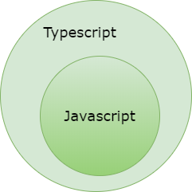

## Typescript

**Typescript** adalah sebuah ***superset javascript*** yang dikembangkan oleh ***Microsoft***, sebuah ***open source project*** yang menginspirasi **Ryan Dahl** untuk mengembangkan **Deno** sebuah ***Runtime Engine*** yang dapat digunakan untuk mengeksekusi ***Typescript***.



Jika anda melihat gambar di atas pasti faham, setiap ***Javascript Code*** adalah sebuah ***Typescript***. ***Typerscript*** memberikan kelebihan baru untuk ***javascript*** sehingga seringkali disebut dengan ***Extended*** ***Javascript***. 

Kelebihan ini dapat digunakan untuk mempermudah pengembangan setiap ***large-scale application*** yang ditulis menggunakan bahasa pemrograman ***Javascript***. Di dalam ***typescript*** kita akan mempelajari konsep seperti :

1. ***Classes***, 
2. ***Modules***, 
3. ***Interface***, 
4. ***Generics***, 
5. Dan ***Static Typing*** menggunakan ***javascript***.

### Typescript Cheatsheet

Dibawah ini adalah ***cheatsheet*** yang akan kita lihat dengan cepat :

#### *Data Types*

Terdapat 3 Tipe data dalam ***typescript*** :

```typescript
var logika: boolean = false;
var usia: number = 26;
var nama: string = "Maudy Ayunda";
```

##### *Number*

Sebuah angka di dalam *typescript* merupakan tipe data *number*.

```typescript
let usia: number = 26;
```

***Javascript*** adalah bahasa dengan karakteristik ***types*** : ***Loosely typed language*** yaitu tidak mengenal ***type*** data seperti ***integer, short, long*** atau ***float*** dan seterusnya. Begitu juga di dalam ***typescript*** seluruh ***number*** representasinya di dalam sistem diubah menjadi 64***-bit floating point***. 

Namun begitu kita tetap bisa menyimpan sebuah nilai angka desimal dalam variabel ***typescript***.

```typescript
let tinggi: number = 900.888;	
```

***Typescript*** juga mendukung ***number-literal*** dalam bentuk ***hex, binary*** dan ***octal***. Perhatikan kode dibawah ini dan ***prefix*** yang digunakan :

```typescript
let dec: number = 27;
let hex: number = 0x001b;
let binary: number = 0b11011;
let octal: number= 0o0033;	
```

##### *String*

Kita bisa menyimpan nilai ***string*** ke dalam sebuah variabel menggunakan ***double*** atau ***single quote***. Perhatikan kode di bawah ini :

```typescript
let nama: string = "Gun Gun Febrianza";
nama = 'Gun Gun Febrianza';
```

***Typescript*** juga mendukung ***template string*** menggunakan ***syntax ${expression}***. Perhatikan kode di bawah ini :

```typescript
var nama: string ="Gun Gun Febrianza";
let nama: string = `Hallo ${nama}, kami doakan semoga anda selalu sehat.`;
```

#### *Union*

Ada saatnya kita menginginkan variabel yang bisa disimpan dengan berbagai ***type***, selain menggunakan ***type any*** kita bisa menggunakan ***union*** . Sebuah ***union*** ***type***adalah ***type***kombinasi dari berbagai ***type***. Kode di bawah ini adalah variabel dengan kemampuan untuk bisa menampung dua ***type***data sekaligus yaitu sebagai ***boolean*** atau ***number***.

```typescript
let isVisible : boolean|number = true;
isVisible = 1; // OK
isVisible = "yes"; // akan menghasilkan error
```

#### *Type Inference*

Selain ketiga tersebut kita bisa menggunakan tipe ***any*** yang bisa di isi apa saja atau disebut ***Type Inference***.

```typescript
var hmm: any = 4;
hmm = "maybe a string instead";
hmm = false;
```

Terkadang kita membutuhkan sifat ***dynamic typing*** bukan hanya ***static typing*** seperti yang telah kita lakukan
setiap kali hendak membuat sebuah variabel. Dalam ***typescript*** kita bisa menggunakan ***any-type***.

```typescript
let diaCantik: any = true; // inisialisasi dengan boolean
console.log(typeof diaCantik);

diaCantik = "benar"; // nilai variabel diubah menjadi string
console.log(typeof diaCantik);

diaCantik.fungsiX();
```

Pada kode di atas ***typeof*** adalah ***keyword*** yang digunakan untuk mengetahui tipe data suatu variabel. ***Any- Type*** yang digunakan akan membuat kompiler untuk tidak memberikan ***semantic error*** saat memeriksa ***type*** yang hendak digunakan. 

***Any-type*** dapat digunakan sebagai contoh saat kita menghadapi kasus dimana kita membutuhkan ***function-parameter*** dengan karakteristik ***argument*** yang bersifat implisit atau tidak diketahui. Di bawah ini adalah contoh ***function*** dengan parameter implisit. Dikatakan implisit karena kita tidak akan pernah tau apa saja nilai yang akan dimasukan kedalam ***parameter***, karena ***parameter*** tidak memiliki ***type*** :

```typescript
function tulisNama(teman:any) {
	console.log(teman.namaKepanjangan);
}
```

#### *Typed Array*

Contoh sebuah ***collection***, di dalam ***typescript*** terdapat terdapat ***typed*** ***Array***.

```typescript
var list: number[] = [1, 2, 3];
```

#### ***Generic Array***

Contoh sebuah ***collection***, di dalam ***typescript*** terdapat ***generic array***.

```typescript
var list: Array<number> = [1, 2, 3];
```

#### *Enumeration*

Contoh sebuah ***Enumeration***.

```typescript
enum Love {Maudy, Ayunda, Faza};
var c: Love = Love.Maudy;
```

Dengan ***enum*** kita bisa membuat ***naming*** yang mudah difahami untuk sebuah angka, ***index*** pada enum juga dimulai dari angka 0 dan seterusnya. Di bawah ini adalah contoh kode ***enum*** :

```typescript
enum Arah { kiri, atas, kanan, bawah }
```

Pada ***enum*** di atas, kiri memiliki ***index*** 0, atas memiliki ***index*** 1, kanan memiliki ***index*** 2 dan bawah memiliki ***index*** 3. Kita juga bisa mengubah ***index*** dari angka awal dalam sebuah ***enum***.

```typescript
enum Arah { kiri = 1, atas, kanan, bawah }
```

Selain itu kita juga bisa menjelaskan seluruh ***index*** dalam ***enum*** secara ***explicit*** :

```typescript
enum Arah { kiri = 1, atas = 2, kanan = 3, bawah = 4}
```

Untuk mengakses nilai yang ada di dalam sebuah ***enum*** kita bisa memanggilnya dengan cara :

```typescript
let nilai: number = Arah.kiri;
```

Atau menggunakan posisi ***index*** yang dimilikinya

```typescript
let nilai: number = Arah[1];
```

#### *Function Return Void*

Contoh sebuah ***function*** dengan ***return void***.

```typescript
function beauty(): void {
	alert("Maudy is beautiful");
}
```

Sebuah ***type void*** digunakan sebagai ***return type*** dari sebuah ***function***. Dengan ***void*** sebuah ***function*** tetap
menghasilkan ***return*** yang tidak memiliki nilai.

#### *Tuples*

Di bawah ini terdapat sebuah ***tuple*** yang memiliki variabel ***string*** dan ***boolean***.

```typescript
let contohTuple: [string, boolean] = ["Gun Gun Febrianza", true];
```

Sebuah ***type string*** berada pada ***index*** ke 0 dan ***boolean*** ada pada ***index*** ke 1. Sebuah ***tuples*** bekerja seperti ***array*** hanya saja bisa memiliki ***type*** yang berbeda. 

#### *Lambda*

Contoh **lambda** dan **type inference**.

```typescript
var func1 = function(i: number): number { return i * i; }
var func2 = function(i: number) { return i * i; }
var func3 = (i: number): number => { return i * i; }
var func4 = (i: number) => { return i * i; }
var func5 = (i: number) => i * i;
```

#### *Interface*

Contoh **interface**, kita bisa membuat opsional ***properties*** yang ditandai dengan simbol ?

```typescript
interface Manusia {
nama: string;
umur?: number;
makan(): void;
}
```

Contoh ***Object*** hasil implementasi dari ***interface*** di atas.

```typescript
var m: Manusia = { nama: "Maudy", makan: () => {} };
var m: Manusia = { nama: "Maudy", umur: 22, makan: () => {} };
```

Contoh ***Interface*** untuk sebuah ***function***.

```typescript
interface fungsiCari {
	(source: string, subString: string): boolean;
}

var data: fungsiCari;
data = function(src: string, sub: string) {
	return src.search(sub) != -1;
}	
```

#### *Class & Properties*

Contoh sebuah ***class*** dengan ***properties*** dan ***function***.

```typescript
class Math {
	x := number;
	hitungSQRT() { 
        return Math.sqrt(this.x * this.x + this.y * this.y); 
    }
}
```

#### *Class* & *Constructor*

Contoh sebuah ***class*** dengan ***constructor.***

```typescript
class Math {
	x := number;
	constructor(x: number, public y: number = 0) {
		this.x = x;
	}
}
```

#### *Class & Static* *Member*

Contoh sebuah ***class*** dengan ***static member***.

```typescript
class Math {
	x := number;
	constructor(x: number, public y: number = 0) {
		this.x = x;
	}
	static koordinat = new A(0, 0);
}
```

#### *Class Instance* 

Contoh sebuah ***object*** dari ***Class Math***.

```typescript
var p1 = new Math(10 ,20);
var p2 = new Math(25); //maka y akan bernilai 0
```

#### *Class Inheritance & Overriding*

Contoh ***inheritance*** dan ***overriding*** dari ***Class Math***.

```typescript
class koordinat3D extends Math {
	constructor(x: number, y: number, public z: number = 0) {
		super(x, y); //wajib menggunakan keyword super
	}
    
	hitungSQRT() {
		var d = super.dist();
		return Math.sqrt(d * d + this.z * this.z);
	}
}
```

#### *Modules*

Contoh sebuah ***Modules***.

```typescript
module Geometry {
	export class Kubus {
		constructor(public lebarsisi: number = 0) {
		}
        
        area() {
            return Math.pow(this.lebarsisi, 2);
        }
	}
}

var s1 = new Geometry.Square(5);
```

Contoh penggunaan ***alias*** untuk menggunakan sebuah ***modules***.

```typescript
import G = Geometry;
var s2 = new G.Square(10);
```

